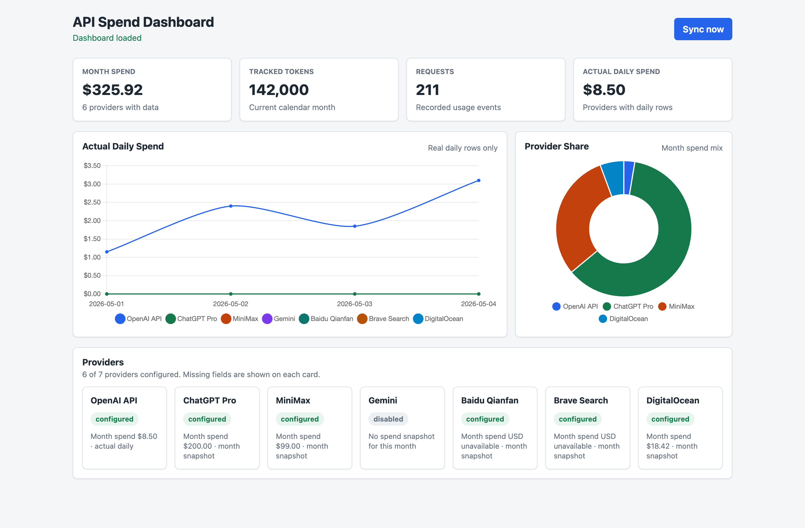

# API Spend Dashboard

Local browser dashboard for tracking personal API and infrastructure usage costs.

## 中文说明

这是一个本地浏览器 dashboard，用来监控你自己的 API 和基础设施费用。后端运行在本机，读取 `.env` 里的配置和密钥，定时调用已启用平台的 API，把用量和费用快照写入本地 SQLite，然后在浏览器里展示总览、趋势、平台状态和缺配置提示。

### 配置指南

各平台 API Key、权限和 Google Cloud Billing Export 的开通步骤见 [API Key 与账单导出开通指南](docs/api-keys-setup.zh.md)。

### 截图



### 运行

```bash
python3 -m venv .venv
.venv/bin/python -m pip install -e ".[dev]"
cp .env.example .env
scripts/restart-server.sh
```

打开 http://127.0.0.1:18765。

`scripts/restart-server.sh` 会停止目标端口上已有的本项目 Uvicorn 进程，然后以前台方式启动 dashboard。使用时保持这个终端开着；要停止服务就按 `Ctrl+C`。如果要换端口：

```bash
PORT=18766 scripts/restart-server.sh
```

### 配置方式

所有密钥都放在 `.env`，不会发送到前端浏览器。建议从 `.env.example` 复制一份 `.env`，然后只开启你已经准备好密钥的平台。

`*_ENABLED` 是平台开关：

- `false`：这个平台不参与定时同步，页面显示 `disabled`。
- `true`：这个平台会参与定时同步；如果必需配置没填，页面显示 `missing_config`。

后台同步间隔由 `SYNC_INTERVAL_HOURS` 控制，默认 6 小时。页面上的 `Sync now` 可以手动立即同步。

### OpenAI API

设置：

```env
OPENAI_ENABLED=true
OPENAI_ADMIN_API_KEY=你的 OpenAI Platform key
```

这个 key 需要有读取 organization usage/costs 的权限。如果你的账号需要指定组织 ID，再填写 `OPENAI_ORG_ID`。

### ChatGPT Pro

ChatGPT Pro 没有官方 token 用量 API，所以这里只作为手动订阅成本记录。设置：

```env
CHATGPT_PRO_ENABLED=true
CHATGPT_PRO_PRICE=你的订阅价格
CHATGPT_PRO_CURRENCY=USD
```

还可以填写 `CHATGPT_PRO_PLAN_NAME`、`CHATGPT_PRO_BILLING_PERIOD`、`CHATGPT_PRO_RENEWAL_DATE`、`CHATGPT_PRO_NOTES`。

### MiniMax

设置：

```env
MINIMAX_ENABLED=true
MINIMAX_API_KEY=你的 MiniMax key
MINIMAX_BASE_URL=https://www.minimax.io
```

套餐名称、价格、开始日期和到期日期通过 `MINIMAX_PLAN_NAME`、`MINIMAX_PLAN_PRICE`、`MINIMAX_PLAN_START_DATE`、`MINIMAX_PLAN_END_DATE` 手动填写。

### Gemini

Gemini 的准确费用通过 Google Cloud Billing Export 到 BigQuery 查询。需要先在 Google Cloud 里开启 Billing Export，然后设置：

```env
GEMINI_ENABLED=true
GOOGLE_APPLICATION_CREDENTIALS=/path/to/service-account.json
GCP_BILLING_PROJECT_ID=你的项目 ID
GCP_BILLING_DATASET=你的 dataset
GCP_BILLING_TABLE=你的 billing export 表
```

`GEMINI_SERVICE_FILTER` 用来匹配 billing export 里的服务名称，默认是 `Gemini API`。

### 百度千帆

设置：

```env
QIANFAN_ENABLED=true
BAIDU_ACCESS_KEY_ID=你的 AK
BAIDU_SECRET_ACCESS_KEY=你的 SK
```

建议使用只读权限的子用户 AK/SK。可选地用 `QIANFAN_SERVICE_IDS` 和 `QIANFAN_APP_IDS` 限定查询范围，多个值用英文逗号分隔。

### Brave Search

设置：

```env
BRAVE_ENABLED=true
BRAVE_API_KEY=你的 Brave Search API key
```

Brave 没有单独的费用查询接口，dashboard 会通过 quota header 估算用量，并用 `BRAVE_PRICE_PER_1000_REQUESTS` 估算费用。

### DigitalOcean

设置：

```env
DIGITALOCEAN_ENABLED=true
DIGITALOCEAN_TOKEN=你的 DigitalOcean token
```

这个 token 需要能读取 billing/balance。

### 数据保存

默认 SQLite 数据库路径是：

```env
DATABASE_URL=sqlite:///./data/api_spend.sqlite3
```

`data/` 目录已被 git 忽略，只保存在本地。

## Run

```bash
python3 -m venv .venv
.venv/bin/python -m pip install -e ".[dev]"
cp .env.example .env
scripts/restart-server.sh
```

Open http://127.0.0.1:18765.

The restart script stops any existing project Uvicorn process on the target port, then starts the dashboard in the foreground. Keep that terminal open while using the dashboard; press `Ctrl+C` to stop it. Runtime PID data is written under `.run/`. To use a different port:

```bash
PORT=18766 scripts/restart-server.sh
```

## Configuration

All secrets live in `.env`. The frontend never receives provider credentials.

Start from `.env.example` and enable only the providers you want to sync.

### OpenAI API

Set `OPENAI_ENABLED=true` and `OPENAI_ADMIN_API_KEY`. The key must have permission to read organization usage and costs. If your account requires an organization identifier, set `OPENAI_ORG_ID` too.

### ChatGPT Pro

Set `CHATGPT_PRO_ENABLED=true` and fill the manual plan metadata: `CHATGPT_PRO_PLAN_NAME`, `CHATGPT_PRO_PRICE`, `CHATGPT_PRO_CURRENCY`, `CHATGPT_PRO_BILLING_PERIOD`, `CHATGPT_PRO_RENEWAL_DATE`, and `CHATGPT_PRO_NOTES`.

ChatGPT Pro does not provide an official token usage API, so this dashboard tracks it as manually entered subscription metadata.

### MiniMax

Set `MINIMAX_ENABLED=true`, `MINIMAX_API_KEY`, and `MINIMAX_BASE_URL`. Fill the manual plan metadata with `MINIMAX_PLAN_NAME`, `MINIMAX_PLAN_PRICE`, `MINIMAX_PLAN_CURRENCY`, `MINIMAX_PLAN_START_DATE`, and `MINIMAX_PLAN_END_DATE`.

### Gemini

Set up Google Cloud Billing Export to BigQuery. Then set `GEMINI_ENABLED=true`, `GOOGLE_APPLICATION_CREDENTIALS`, `GCP_BILLING_PROJECT_ID`, `GCP_BILLING_DATASET`, and `GCP_BILLING_TABLE`.

Use `GEMINI_SERVICE_FILTER` to control which exported billing rows are counted as Gemini spend.

### Baidu Qianfan

Set `QIANFAN_ENABLED=true`, `BAIDU_ACCESS_KEY_ID`, and `BAIDU_SECRET_ACCESS_KEY`. The AK/SK pair needs Qianfan read permissions. Optional filters are available through `QIANFAN_SERVICE_IDS` and `QIANFAN_APP_IDS`.

### Brave Search

Set `BRAVE_ENABLED=true` and `BRAVE_API_KEY`. Cost is estimated from quota headers and the configured request price in `BRAVE_PRICE_PER_1000_REQUESTS`; set `BRAVE_CURRENCY` to match that price.

### DigitalOcean

Set `DIGITALOCEAN_ENABLED=true` and `DIGITALOCEAN_TOKEN`.

## Data

SQLite data is stored under `data/` by default through `DATABASE_URL=sqlite:///./data/api_spend.sqlite3`. The `data/` directory is ignored by git.
